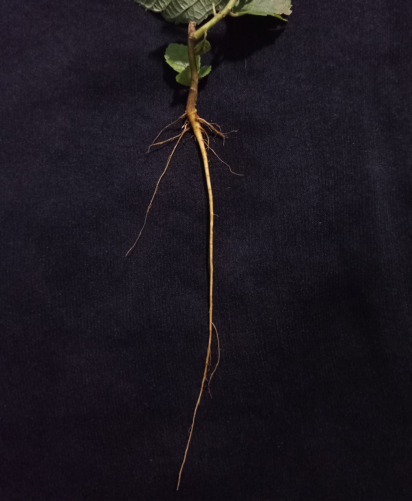
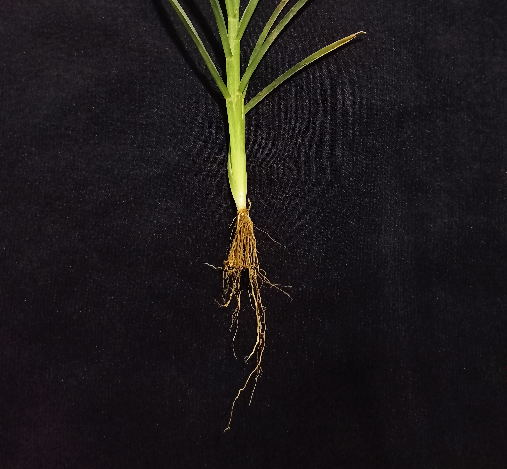
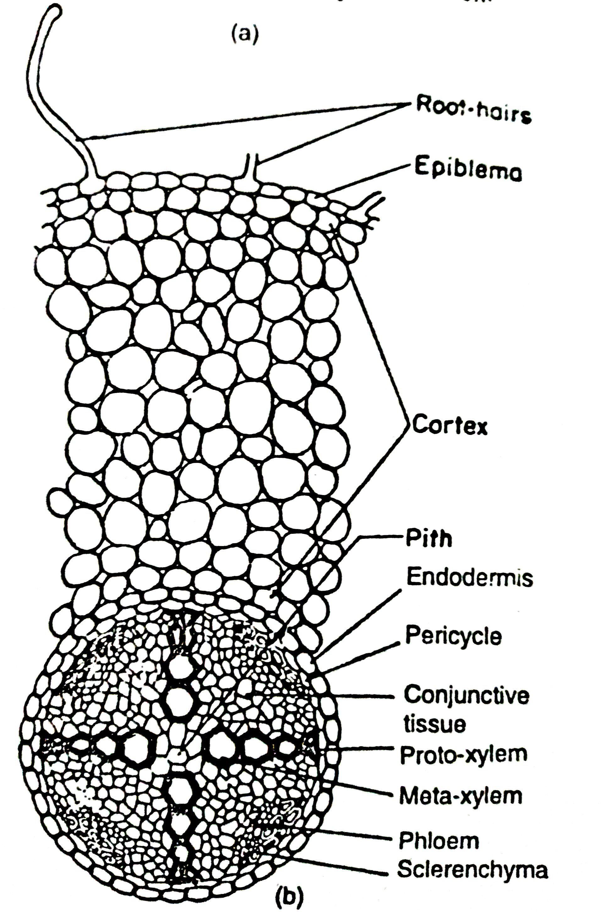

## Theory

In the field of plant physiology, the relevance of root anatomy and its activities assumes a lot of significance. Roots are the underground parts of plants that perform critical roles. They secure the plant in the soil, draw in water and essential nutrients. They frequently also act as storage for food. These functions are vital for the plant's stability, growth, and survival.

Edible roots are roots of certain plants that are commonly consumed as food. These roots are often rich in nutrients and have been cultivated and eaten for centuries in various cultures around the world. Some examples of edible roots are; Carrot (Daucus carota L.) Beetroot (Beta vulgaris L.) Radish (Raphanus raphanistrum subsp. sativus (L.) Turmeric (Curcuma longa L.) etc.

Roots of various plants have been used in traditional and modern medicine for their therapeutic properties. They have been used in various cultures for centuries. Modern research continues to explore their medicinal potential as well as other uses.

Asparagus root, specifically from the species Asparagus racemosus Willd. (commonly known as Shatavari), has a long history of traditional use in various cultures, particularly in Ayurveda, the traditional system of medicine in India. Shatavari is renowned for its benefits to female reproductive health. It is used to support lactation in nursing mothers, balance hormones and improve fertility. It is also used to alleviate symptoms of menopause and menstrual disorders. The root is traditionally used to improve digestion, relieve ulcers and treat gastrointestinal disorders. It is thought to have a soothing effect on the digestive tract.

#### Types of roots: 
The major types of roots can be broadly categorized into two main systems:
**Taproot System:** This is characterized by a single, thick primary root that grows directly downward. From this primary root, smaller lateral roots branch out. Taproots are efficient at reaching deep water sources and anchoring the plant firmly in the soil e.g. Carrots (Daucus carota L.), Radishes (Raphanus raphanistrum subsp. sativus (L.) Domin), Mango (Mangifera indica L.), Neem (Azadirachta indica A.Juss.), Fig (Ficus racemosa L.)

**Fibrous Root System:** This is composed of many thin, moderately branching roots growing from the stem. These roots spread out in the soil and are generally shallower than taproots. Fibrous roots are effective at preventing soil erosion and are common in monocotyledons. e.g. Rice (Oryza sativa L.), Corn (Zea mays L.)

Fig.: (A) Tap Root, (B) Fibrous Root

Understanding the internal anatomy of the root assists in understanding how the various functions are carried out as the nature of specialised activities. The different types of cells in a root are as follows:

**Root Cap:** A plant's root cap is a unique structure located at the very tip of the root that is essential for shielding the root from the elements as it penetrates the soil.

Root Cap Cells: Guard the tip of the root as it penetrates the soil. Mucilage is secreted by these cells to facilitate the root's migration.

surrounding cells that help secrete mucilage and safeguard the root.

**Meristematic Zone (Apical Meristem):** The meristematic zone, also known as the region of cell division, is a crucial part of a plant root located just behind the root cap.

Meristematic Cells: Meristematic cells are found at the tip of the root. They are small, undifferentiated, and actively dividing cells. All other root tissues originate from them.

The meristematic zone is the engine of root growth, allowing the plant to continuously generate new cells that support the root's capacity to absorb water and nutrients as well as expand. 

**Elongation Zone:** The elongation zone in a plant root is a region where cells produced in the meristematic zone increase in size, contributing to the growth and lengthening of the root. 

Elongating Cells:  Cells in this zone elongate and contribute to the lengthening of the root. Cells in this zone undergo rapid elongation, significantly increasing in length. This process pushes the root tip further into the soil, allowing the root to explore new areas for water and nutrient absorption.

**Maturation Zone (or Differentiation Zone):** The maturation zone is vital for the proper functioning of the root, as it is where cells complete their differentiation into specialized types necessary for the root's roles in absorption, storage, and transport. The development of root hairs and various tissues in this zone ensures that the root can efficiently support the plant's needs for water and nutrients. 

Epidermal Cells: These cells form the outer layer, some of which differentiate into root hairs that increase surface area for water and nutrient absorption.

Cortex Cells: They are located beneath the epidermis. These parenchyma cells store food and help in the transport of water and nutrients.

Endodermis: A single cell layer that acts as a selective barrier regulating the movement of substances into the vascular cylinder.

The Casparian strip is a critical feature in plant roots, particularly in the endodermal cells of the maturation zone.

Casparian strip (a band of suberin) in their walls that forces water and solutes to pass through the cell membrane rather than between cells.

Pericycle Cells: These cells located just inside the endodermis, these cells can become meristematic and contribute to the formation of lateral roots.

The pericycle is a dynamic and versatile layer of cells in plant roots, essential for lateral root formation, contributing to secondary growth, and aiding in regeneration and healing. Its ability to become meristematic allows it to play a crucial role in the growth and development of the root system, ensuring the plant can efficiently anchor itself and absorb the necessary resources from the soil.

Vascular Tissue (Xylem and Phloem): The vascular tissues of a plant root are responsible for the transport of water, nutrients, and organic compounds throughout the plant. These tissues are organized into two main types: xylem and phloem.

Xylem Cells: Xylem cells are responsible for carrying minerals and water from the root to the rest of the plant. made up of different cell types such as xylem fibers, xylem parenchyma, vessel components, and tracheids.

In dicot roots, xylem frequently forms a central core with several outward-extending arms arranged in a star pattern.

In roots, xylem often forms a central core with a star-shaped arrangement in dicots, with several arms extending outward.

Phloem Cells: These cells are transport sugars and other metabolic products from the leaves to the root. Composed of sieve tube elements, companion cells, phloem fibers, and phloem parenchyma.

Phloem is typically located outside the xylem, forming a ring around it in dicot roots. In monocots, the arrangement is more scattered.

The xylem and phloem together make up the vascular cylinder, also known as the stele.

Fig: T.S of a dicot root

#### Interesting facts about roots:

Adventitious roots can grow from parts of the plant other than the root system, such as stems or leaves. Banyan trees develop aerial prop roots that grow down from branches, providing additional support and enabling them to cover a large area.
e.g.- Banyan Tree (Ficus benghalensis L.)

Aerial roots are above-ground roots that help plants survive in waterlogged environments. Mangroves have specialized aerial roots called pneumatophores that enable them to absorb oxygen in oxygen-poor soils.
e.g.- Mangroves (Rhizophora mucronata Poir.)

Buttress roots are large, flared roots at the base of the tree that provide stability in shallow soils. They help support tall trees in tropical rainforests, allowing them to reach sunlight while resisting strong winds.
e.g.- Ceiba Tree (Ceiba pentandra (L.) Gaertn.)

Prop roots grow from the stem above the ground and provide additional support, especially in tall plants like corn. They help stabilize the plant and prevent lodging (falling over) during strong winds.
e.g. Corn (Zea mays L.)

### Equipment Required

- Fresh tap root (Carrot)
- Single edged sharp new blades
- Microscope slides 
- cover slips
- Beaker
- Watch glass
- Stains (e.g., safranin, fast green, iodine)
- Dissecting needle
- Forceps
- Dropper 
- Light microscope
- Blotting paper
